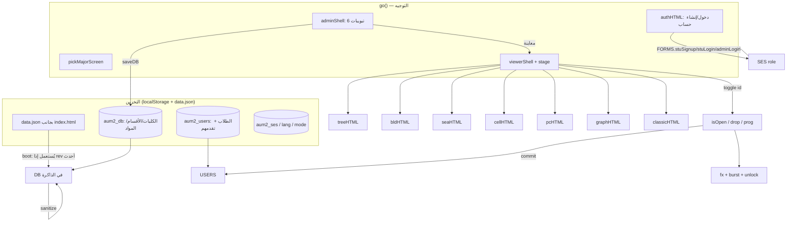

# تسليم المشروع — خريطة المواد التفاعلية (AUM / IRSE)

> للأيجنت اللي رح يكمل: اقرأ هذا الملف أولاً. الكود الكامل جاهز وشغال بـ `index.html`،
> ومصدره المقسّم بـ `irse-source.zip` (`parts/` + `build.sh`).
> **المستخدم بحكي عربي (لهجة أردنية).** رد عليه بالعربي، وبدون أسئلة كثيرة.

## 1) وين وصلنا (كله مختبَر بمتصفح Chromium تلقائي، بدون أخطاء JS)

| الميزة | الحالة |
|---|---|
| تسجيل دخول طالب (حساب جديد: الاسم، الرقم الجامعي، كلمة مرور، **الكلية ← ثم القسم**) | ✅ |
| دخول مدير (`admin` / `admin123`) | ✅ |
| لوحة المدير: كليات، أقسام، مواد (متطلبات، منع الحلقات المغلقة)، اختياريات، طلاب، بيانات | ✅ |
| الساعات المعتمدة لكل مادة (من ملف الـPDF الرسمي) + عدّاد الساعات المنجزة | ✅ |
| تصحيح 6 متطلبات ناقصة بالخطة الأصلية حسب الـPDF | ✅ |
| 7 أوضاع عرض: 🌳 شجرة، 🏢 عمارة، 🌊 بحر، 🧬 خلية، 💻 حاسوب، 🔬 دارة، 📋 خطة | ✅ |
| حركات: ثمار تتأرجح، سمك يسبح ويقفز وفقاعات، خلية ATP، شرائح LED + تدفق بيانات، كهرباء بين العقد | ✅ |
| تأثير "فتح مادة جديدة" (توهج للمواد اللي انفتحت بسبب مادة أنجزتها) | ✅ |
| عربي/English + RTL/LTR، موبايل، وضع داكن | ✅ |
| تصدير/استيراد `data.json` (فيه الكليات والأقسام والمواد)، ويقبل الصيغة القديمة (بدون كليات) | ✅ |
| تصدير الطلاب CSV | ✅ |
| وضع "دارة" مستوحى من ملف **BioCircuit** اللي عمله المستخدم (عقد + كهرباء + ميتوزس) | ✅ |

## 2) المعمارية



## 3) الملفات (`parts/` بنفس ترتيب البناء)

| الملف | الدور |
|---|---|
| `head.html` / `mid.html` | هيكل الصفحة + `<symbol id="fish">` |
| `styles.css` | كل التنسيق (قسم لكل وضع + admin + auth) |
| `config.js` | `ADMIN_USER`, `ADMIN_HASH` |
| `sha.js` | SHA-256 صرف (مختبَر مقابل Node crypto) |
| `data.js` | الخطة الأصلية `RAW`/`STONES`، `HOURS`، `defaultDB()` |
| `core.js` | `sanitize`, نصوص `T` (ar/en), الحالة العامة, `toggle/drop/prog`, مساعدات القوائم (`facOptions`, `majorOptions`, `groupedMajors`) |
| `views.js` | المشاهد السبعة، `viewerShell`, `stage`, الـtooltip والإبراز، `fx`/`burst` |
| `auth.js` | شاشة الدخول والتسجيل، `FORMS` |
| `admin.js` | لوحة المدير والنوافذ (`openDlg`), تصدير/CSV |
| `boot.js` | الإجراءات `A{}`, ربط الأحداث, `go()`, `boot()` |

بناء: `bash build.sh` ← `dist/index.html`. الاختبارات: `tests/t6.py` و`tests/t7.py` (Playwright).

## 4) نموذج البيانات

```
DB = { rev, faculties:[{id,ar,en}],
       majors:[{ id, fid, ar, en, years(1-8),
                 courses:[{id, y, h(0-12), ar, en, pre:[courseId…]}],
                 electives:[{id, h, ar, en}] }] }
USERS = [{ sid, name, ph(sha256), majorId, done:[ids], created }]
```
القاعدة: المادة "مفتوحة" إذا كل متطلباتها مشطوبة. إلغاء شطب مادة بيلغي المواد المعتمدة عليها.

## 5) قيود لازم تنذكر للمستخدم

1. بدون سيرفر: الحسابات والتقدم على متصفح كل طالب، ولوحة المدير ما بتشوف إلا طلاب نفس المتصفح.
2. التحقق من كلمة المرور داخل المتصفح (مش حماية حقيقية).
3. اللي جرّب النسخة القديمة على نفس المتصفح: يضغط "استرجاع الخطة الأصلية" من البيانات عشان تنزل الساعات والكليات.

## 6) خطة الشغل المتبقية (بالأولوية)

1. **سيرفر حقيقي (Firebase/Supabase)** — يحل 1 و2 فوق. نقاط التبديل: `ls` + `saveDB/saveUsers` + `FORMS` + `boot()`. الأفضل Auth حقيقي للمدير وجدول `users`, `faculties`, `majors`, `courses`.
2. **شاشة اختيار الكلية/القسم كبطاقات** مثل BioCircuit (بعد التسجيل)، مع بطاقات "قريباً" معطّلة. حالياً قائمتين مترابطتين.
3. **تصنيف المواد (`cat`)** كحقل اختياري بالنموذج + خيار بالمدير، وتلوين عقد وضع "دارة" حسب التصنيف (رياضيات، كهرباء، برمجة، ذكاء، روبوتات…) بدل التلوين حسب السنة، وشريط ATP للتقدم.
4. **منطق الاختيارية**: الطالب بحتاج 3 من 10 اختيارية قسم، و3 مجموعات جامعية. النسبة حالياً بتحسب كل الاختيارية. المطلوب: حقل `need` لكل مجموعة + تقدم بالساعات من 160.
5. **متطلب مرافق (Sim)**: بالـPDF بعض المتطلبات "تزامنية". حالياً كلها متطلب سابق. المقترح حقل `co:[]`.
6. تحسينات صغيرة: الـtooltip بيضل بعد الكبس (بسبب focus)، تحسين وضع "دارة" على الموبايل، ARIA للعقد، شعار `aum_logo.png`.
7. **تأكيد من المستخدم**: افترضنا إن مواد وضع البحر = أسماك (كلمته كانت غير واضحة). إذا بدو غيرها، `seaHTML` + `.fs` بـstyles.css.

## 7) برومبت جاهز تلصقه للأيجنت الثاني

> عندي مشروع "خريطة المواد التفاعلية" لجامعة AUM، ملف `index.html` واحد (HTML/CSS/JS صرف). المصدر بـ `irse-source.zip`.
> اقرأ `HANDOFF.md` أولاً. شغّل `bash build.sh` وتأكد إن `dist/index.html` يطلع مثل المسلَّم.
> المطلوب: نفّذ البند رقم ___ من "خطة الشغل المتبقية". لا تكسر الأوضاع السبعة ولا اللغتين، وشغّل `tests/t6.py` و`t7.py` بعد كل تعديل.
> رد بالعربي.

## تحديث (جلسة لاحقة)
- **وضع الدارة**: صار أشرطة سنوات (كل سنة شريط ملوّن بعنوان وعدّاد مكتمل/كلي) داخل صفحة الموقع بدون سكرول داخلي. الأسلاك بتنرسم بـ `gwires()` من مواقع العقد الفعلية.
- **الجامعات**: `DB.universities:[{id,ar,en}]` و`faculty.uid`. تبويب "الجامعات" بالأدمن قبل الكليات. الطالب بيختار الجامعة ← الكلية ← القسم. البيانات القديمة بتنهاجر تلقائياً لجامعة AUM (`u_aum`).
